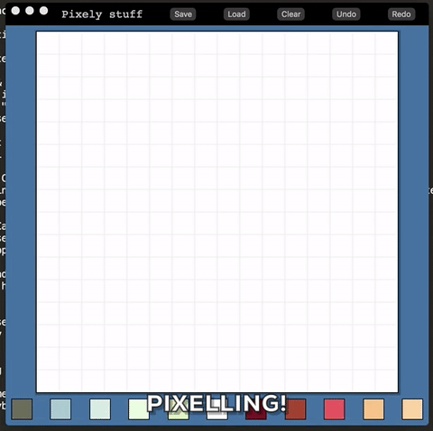

# Pixelectronica :fire:

Electron/React/Redux application for creating pixel art!

## Installation

1. Clone the repo!
1. `npm run install`!
1. `npm start`!
1. Doodle!!

## Tools

- [Electron](http://electron.atom.io/) - awesomely simple tool for building cross-platform apps! SO EXCITE
- [React](https://facebook.github.io/react/) - for building HTML components and managing UI
- [Redux](http://redux.js.org/) - for retaining and managing app-wide state
- [lodash](https://lodash.com/) - for workin' with data structures more easily

# Features ✨

### Pencil & Fill tools
  - Need to implement decent flood-fill ✅
  - Add new "modes" - pencil/fill ✅
  - Allow user to choose using UI ✅

### Palette Customization
  - Create interface to allow users to change/save/export/whatnot their own color palettes. ✅
  - How to persist? Shareable? **(Using presets for now.)**

### Save/Load
  - Allow users to save/load JSON objects representing image. ✅

### Export
  - Save png to user's comp ✅

### Building with Electron
  - `npm run dist` should work fine. Just need to make sure there are no code-signing problems. 

# Bugs! 🐛

- Grid toggle button does not trigger a re-render of the canvas.

# Upcoming Features 🌅

## Next:

### Code Reorganization
  - Clean up components & separate out where necessary
  - Divide into containers & presentational components

### Layers
  - Allow multiple layers! _(Note: Abstract the grid to layer)_
  - Allow users to move individual layers

### Resize Canvas
  - Allow user to use slider/input/whatever to choose resolution of image.
  - What happens when they resize after drawing? New canvas? Lose info?

### Pallette Enhancements
  - Create a richer interface for choosing/switching/previewing palettes.
  - Allow users to modify pallette colors.
  - Allow users to save new custom pallettes.
  - Allow users to delete unwanted pallettes.
  - Allow users to import/export pallettes.
  - Creation of 16, 32, 64-bit pallettes? Should there be a limit? Can users add colors, or only replace?
  - Design question - allow users to convert entire image to new pallette, or use additional pallettes as they see fit?
    - If additional pallettes are chosen - add a color picker!
    - If not, re-jigger palette logic to replace all colors and redraw (save a reference to color1, 2 etc instead of storing the CSS color)
    - What if users import someone else's drawing, though? Should palette data be included with drawings?
  - Allow users to drag and "re-order" colors to swap colors in their image - this applies after pallettes are standardized

### Export/Save Options
  - Successful save/error confirmation
  - Provide a preview image before export
    - Allow users to decide resolution, grid visibility
    - PNG/JPG?
  - Include metadata when saving JSON - title, author, pallette colors, etc.

### Loading Enhancement
  - Utilize image preview to allow users to preview images before they load them from JSON files.

### Errors
  - Should provide errors in case of:
    - Unable to load image JSON
    - Unable to save JSON
    - Unable to export to PNG
    - And so much more! ✨

## Maybe Later: 🕗

### Replay
  - Allow user to "replay" the creation of their image.
  - Possibly add ability to export this as a gif!! That would be cooooool.

### Animations
  - If GIF export is easy enough, perhaps use layers to create short animations.

### Gradient Tool
  - Fun tool to allow patterned fill! Maybe.

### Social media sharing?
  - Meh. Maybe.

### Photo Import
  - Allow users to import/pixelize/edit photos!
